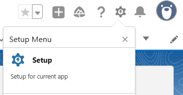
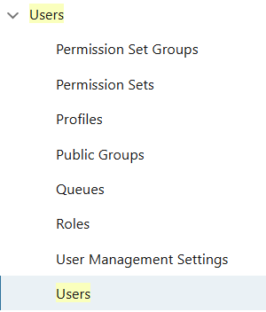
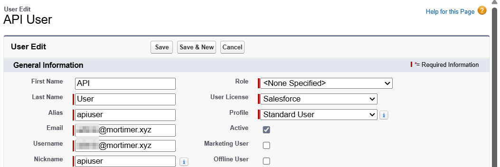
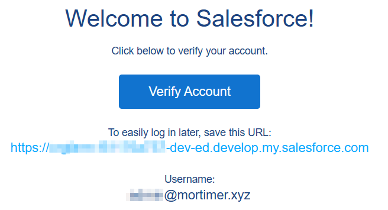
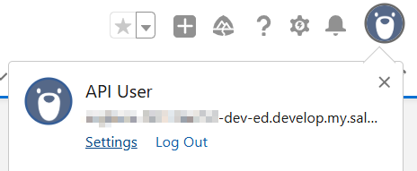
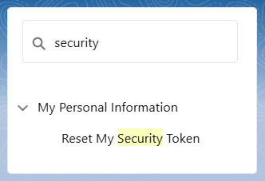
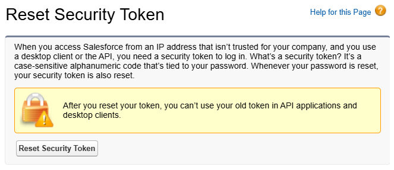
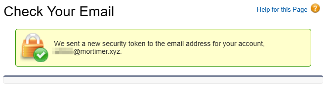
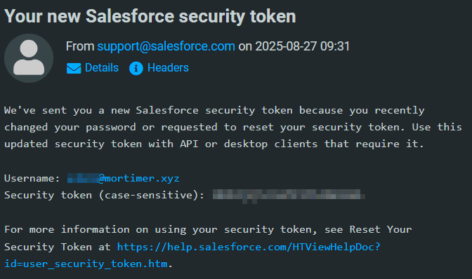

# Extract objects from SalesForce

This will run all the SQL scripts in the SQL directory based on the list in the configuration CSV.

## Setting Up a Salesforce Developer Edition for API Access

The first step is getting an API user set up. We can use a Salesforce Developer Edition account to create a user specifically for API use and then get an API key (security token).

### Step 1: Sign Up for Salesforce Developer Edition

1. Go to [https://developer.salesforce.com/signup](https://developer.salesforce.com/signup).
2. Fill in your details and create your account.
3. Check your email and verify your Salesforce Developer account.

### Step 2: Log Into Your Developer Org

* Visit [https://login.salesforce.com](https://login.salesforce.com) and sign in with your new Developer account.
* Click the ⚙️ gear icon → **Setup** to access the admin panel.



### Step 3: Create a New Standard User for API Access

To keep your main account separate from scripts, it’s best to create a dedicated API user:

1. In **Setup → Quick Find**, search **Users** → click **Users**.
2. Click **New User**.



3. Fill in the required fields:
   * **First Name / Last Name:** `API User`
   * **Email:** your accessible email
   * **Username:** unique across all Salesforce orgs
   * **Alias:** e.g., `apiuser`
   * **User License:** **Salesforce** (standard)
   * **Profile:** **Standard User**
4. Save the user.



You would have gotten an email to the new users email inbox.



### Step 4: API Access

For a Standard User, API access is usually enabled by default.

### Step 5: Get the Security Token

Salesforce requires a security token for API login from outside their UI:

1. Log in as the new Standard User.
2. Click your avatar → **Settings**.



3. In Quick Find, search **Reset My Security Token**.



4. Click **Reset Security Token** → Salesforce emails it to you.



You will get an email with the security token in the email.





## Example usage

Setup your Python environment.

```sh
python3 -m venv ~/venv/sfde
source ~/venv/sfde/bin/activate
pip install --upgrade pip
pip install poetry
poetry lock && poetry install
```

Run the Python script to execute the queries

```sh
python3 app.py --query all
```

```log
2025-05-05 14:47:40,042 - INFO - Successfully connected to Salesforce
2025-05-05 14:47:40,051 - INFO - Executing query: 
select
  count(Id)
from
  account
2025-05-05 14:47:40,553 - INFO - Query returned 1 records
OrderedDict({'attributes': OrderedDict({'type': 'AggregateResult'}), 'expr0': 14})
2025-05-05 14:47:40,559 - INFO - Executing query: 
select
  count(Id)
from
  contact
2025-05-05 14:47:40,908 - INFO - Query returned 1 records
OrderedDict({'attributes': OrderedDict({'type': 'AggregateResult'}), 'expr0': 21})
2025-05-05 14:47:40,915 - INFO - Executing query: 
select
  Id
, name
from
  contact
2025-05-05 14:47:41,194 - INFO - Query returned 21 records
OrderedDict({'attributes': OrderedDict({'type': 'Contact', 'url': '/services/data/vM.m/sobjects/Contact/<>hQAE'}), 'Id': '<>hQAE', 'Name': 'Rose Gonzalez'})
OrderedDict({'attributes': OrderedDict({'type': 'Contact', 'url': '/services/data/vM.m/sobjects/Contact/<>iQAE'}), 'Id': '<>iQAE', 'Name': 'Sean Forbes'})
OrderedDict({'attributes': OrderedDict({'type': 'Contact', 'url': '/services/data/vM.m/sobjects/Contact/<>jQAE'}), 'Id': '<>jQAE', 'Name': 'Jack Rogers'})
OrderedDict({'attributes': OrderedDict({'type': 'Contact', 'url': '/services/data/vM.m/sobjects/Contact/<>kQAE'}), 'Id': '<>kQAE', 'Name': 'Pat Stumuller'})
OrderedDict({'attributes': OrderedDict({'type': 'Contact', 'url': '/services/data/vM.m/sobjects/Contact/<>lQAE'}), 'Id': '<>lQAE', 'Name': 'Andy Young'})
OrderedDict({'attributes': OrderedDict({'type': 'Contact', 'url': '/services/data/vM.m/sobjects/Contact/<>mQAE'}), 'Id': '<>mQAE', 'Name': 'Tim Barr'})
OrderedDict({'attributes': OrderedDict({'type': 'Contact', 'url': '/services/data/vM.m/sobjects/Contact/<>nQAE'}), 'Id': '<>nQAE', 'Name': 'John Bond'})
OrderedDict({'attributes': OrderedDict({'type': 'Contact', 'url': '/services/data/vM.m/sobjects/Contact/<>oQAE'}), 'Id': '<>oQAE', 'Name': 'Stella Pavlova'})
OrderedDict({'attributes': OrderedDict({'type': 'Contact', 'url': '/services/data/vM.m/sobjects/Contact/<>pQAE'}), 'Id': '<>pQAE', 'Name': 'Lauren Boyle'})
OrderedDict({'attributes': OrderedDict({'type': 'Contact', 'url': '/services/data/vM.m/sobjects/Contact/<>qQAE'}), 'Id': '<>qQAE', 'Name': 'Babara Levy'})
OrderedDict({'attributes': OrderedDict({'type': 'Contact', 'url': '/services/data/vM.m/sobjects/Contact/<>rQAE'}), 'Id': '<>rQAE', 'Name': 'Josh Davis'})
OrderedDict({'attributes': OrderedDict({'type': 'Contact', 'url': '/services/data/vM.m/sobjects/Contact/<>sQAE'}), 'Id': '<>sQAE', 'Name': 'Jane Grey'})
OrderedDict({'attributes': OrderedDict({'type': 'Contact', 'url': '/services/data/vM.m/sobjects/Contact/<>tQAE'}), 'Id': '<>tQAE', 'Name': 'Arthur Song'})
OrderedDict({'attributes': OrderedDict({'type': 'Contact', 'url': '/services/data/vM.m/sobjects/Contact/<>uQAE'}), 'Id': '<>uQAE', 'Name': 'Ashley James'})
OrderedDict({'attributes': OrderedDict({'type': 'Contact', 'url': '/services/data/vM.m/sobjects/Contact/<>vQAE'}), 'Id': '<>vQAE', 'Name': 'Tom Ripley'})
OrderedDict({'attributes': OrderedDict({'type': 'Contact', 'url': '/services/data/vM.m/sobjects/Contact/<>wQAE'}), 'Id': '<>wQAE', 'Name': "Liz D'Cruz"})
OrderedDict({'attributes': OrderedDict({'type': 'Contact', 'url': '/services/data/vM.m/sobjects/Contact/<>xQAE'}), 'Id': '<>xQAE', 'Name': 'Edna Frank'})
OrderedDict({'attributes': OrderedDict({'type': 'Contact', 'url': '/services/data/vM.m/sobjects/Contact/<>yQAE'}), 'Id': '<>yQAE', 'Name': 'Avi Green'})
OrderedDict({'attributes': OrderedDict({'type': 'Contact', 'url': '/services/data/vM.m/sobjects/Contact/<>zQAE'}), 'Id': '<>zQAE', 'Name': 'Siddartha Nedaerk'})
OrderedDict({'attributes': OrderedDict({'type': 'Contact', 'url': '/services/data/vM.m/sobjects/Contact/?'}), 'Id': '?', 'Name': 'Jake Llorrac'})
OrderedDict({'attributes': OrderedDict({'type': 'Contact', 'url': '/services/data/vM.m/sobjects/Contact/&'}), 'Id': '&', 'Name': 'Shane Warne'})
```
